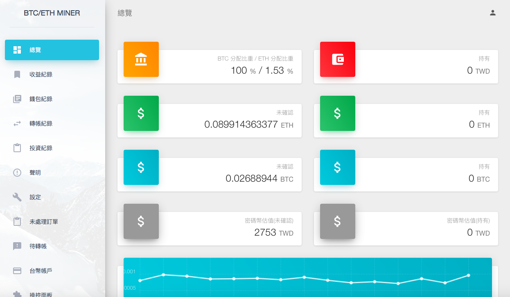

crypto-miner
---

## Screenshot


## Description
This is a management platform for crypto currency(i.e: Bitcoin or other altcoin).  
You can save withdrawal or revenue record easily ;)

## Requirements
* PHP70
* Node.js 8.0 and npm

## How to install
```bash
composer install
npm run prod
php artisan migrate
php artisan db:seed
```

## Author
@michael34435
